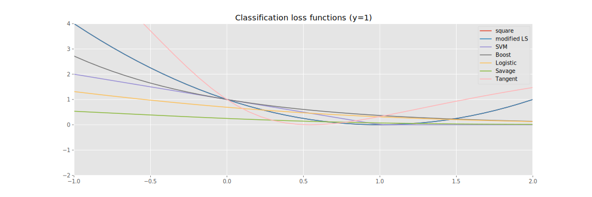
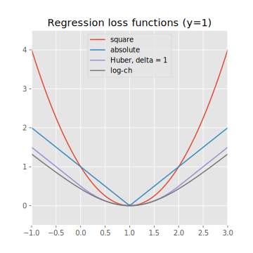
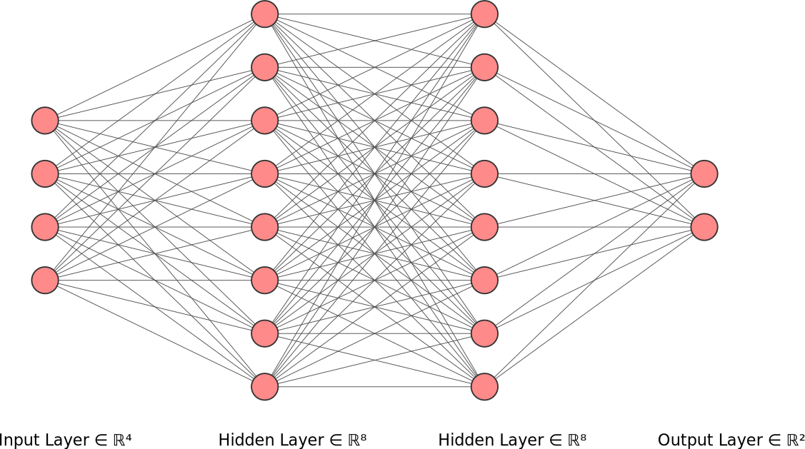
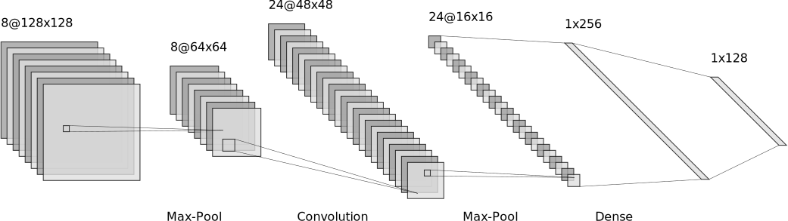

## Data representation

### Definitions

+ $X$: real random vector taking values in $\mathcal{X}$
+ $Y$: real random vector taking values in $\mathcal{Y}$
  + For a regression problem: $\mathcal{Y}=\mathbb{R}$
  + For a classification problem: $\mathcal{Y} = \{C_k \}_{k<K}$ ($K$ classes)
+ $p_{XY}$ joint distribution of $(X,Y)$, unknown

### Pre-treatments

For a dataset $\mathcal{X}_n$, composed of $n$ samples from $X$ we note:

+ $x$ the dataset
+ $x_i$ the $i$-th sample
+ $x_i^{(j)}$ the $j$-th feature of the $i$-th sample

Several pre-treatments can be applied:

#### One-Hot encoding

To encode string features with a finite amount of values possibles $l$, it is better to encode them in a $l$ long binary vector. For example, if the feature is "color", and the possible values are "red", "yellow" and "green", they'll be eoncoded as:

+ red = [1,0,0]
+ yellow = [0,1,0]
+ green = [0,0,1]

This ensures that the euclidian distance between each color is the same and won't damage the learning.

#### Feature rescaling (normalization and standardization)

|Normalization | Standardization |
|----|----|
|$x^{(j)} \leftarrow \frac{x^{(j)} - min^{(j)}}{max^{(j)} - min^{(j)}}$|$x^{(j)} \leftarrow \frac{x^{(j)} - \mu^{(j)}}{\sigma^{(j)}}$ |

To chose between the two there is no general rule, but:

+ In practice, unsupervised algorithms more often benefit from standardization than from normalization
+ Standardization is better if the feature is already distributed along a gaussian
+ Standardization is also better if the dataset contains outliers (because normalization squeeze them)
+ In all other cases, normalization has to be prefered because it ensures that all features are in the same range, and that not anyone will dominate during optimization. It also prevents overflows in calculs

### Handling missing data

When some feature values are missing from the dataset, one can:
+ Remove the corresponding data sample (if the dataset is big enough)
+ Use a learning algorithm that can deal with missing features
+ Use a data imputation technique

#### Data imputation techniques

+ Replace the missing value by an average value of the feature in the dataset
+ Replace it by a value outside the normal range, the idea is that the algorithm will learn what to do when a feature has a value different from others
+ Replace it by a median value in the normal range, the idea is that a median value won't have a big impact on the prediction.
+ Use all the remaining features to built the missing using a regression algorithm

### Dimensionality reduction

Finally, if the dataset dimension is too big, the optimization will be slow because of the curse of dimensionnality. One way to accelerate the training is to reduce dimensionnality, by keeping the maximum of information using PCA or other algorithms.

## Discriminative problems

In discriminative problems, we have a labelized sample $\mathcal{D}_n = \{(x_i, y_i) \in \mathcal{X}\times\mathcal{Y}\}$, from $p_{XY}$, and we want to directly determine $p(y | x)$

### Loss and risk functions

Goal of a machine learning algorthm: find function $f$ that can predict new values with the best accuracy.

+ Loss function $L(y_{pred},y)$: measure the error of the predictor.
+ Risk function $R(f) = \mathbb{E}_{XY}(L(Y,f(X)))$
+ Empirical risk function $R_{emp}(f) = \frac{1}{n} \sum_i L(y_i, f(x_i))$

The problem real solution is
$$
f^* = \arg \min_f R(f)
$$

To solve the problem, we chose a restricted set of possible function $\mathcal{F}$ (either parametric model, either not). We note:
$$
\tilde{f} = \arg \min_{f \in \mathcal{F}} R(f)
$$

As we only have a sample $\mathcal{D_n}$ of the distribution $p_{XY}$, which is unknown, in practise we compute:
$$
\hat{f} = \arg \min_{f \in \mathcal{F}} R_{emp}(f)
$$

Errors:

+ approximation: $f^*-\tilde{f}$
+ estimation: $\tilde{f}-\hat{f}$
+ total: $f^* - \hat{f}$

### Parametric models

#### Maximum Likelihood principle

In Machine Learning, most of the time we make assumption on data:

$$
y = f_\theta(x) + \epsilon
$$

with $\epsilon$ iid zero mean noise.

So : $y \sim F(f_\theta(x))$

Let $p_\theta$ be the estimated parametric distribution of $y|x$, then its log-likelihood is defined by:

$$
\mathcal{L}(f_\theta) = \sum_{i=0}^n \ln{p_\theta(y_i|x_i)}
$$

The corresponding MLE estimator is: $\hat{f_\theta} = \arg \max_{\theta} \mathcal{L(f_\theta)}$

MLE can be seen as a particular case of risk minimization, with $L(f_\theta(x), y)=-\ln{p_\theta(y|x)}$  (for a $L^2$ loss, with a linear model and a normal error, the Least-square model naturally appears). And we have:

$$
R_{emp}(f_\theta) = - \frac{1}{n} \sum_{i=0}^n \ln{p_\theta(y_i|x_i)}
$$

$$
R(f_\theta) = \mathbb{E}(-\ln{p_\theta(Y|X)})
$$

$$
R(f_\theta) - R(f^*) = \text{KL}(p_\theta, p^*)
$$

#### Loss minimization

So, minimizing the risk (or maximizing the likelihood) often leads to a problem of the form:

$$
\min_\theta \frac{1}{n} \sum_{i=1}^{n} L( f_\theta(x_i), y_i ) + \lambda C(\theta)
$$

where:

+   $L$ is a loss function
+   $f_\theta$ is the prediction function ($\theta$ is the parameter to optimize)
+   $C$ is a regularization function and $\lambda$ a regularization factor

##### Linear case

Here the model are linear, $f_\theta(x) = \theta^Tx$. For this kind of mdel, Fenchel duality can be used to simply express the dual problem, which can be exploited for the kernel trick.

|Primal                                                   | Dual                                                                                            |
|---------------------------------------------------------|-------------------------------------------------------------------------------------------------|
|$\min_\theta \frac{1}{n} \sum_{i=1}^{n} L(y_i, \theta^Tx_i) + C(\theta)$|$\max_\alpha \frac{1}{n} \sum_{i=1}^{n} -L^{\#}(y_i,-\alpha_i ) - C^{\#}(\sum_{i=1}^{n} \alpha_i x_i)$|

Where $L^\#$ and $C^\#$ are the convex conjugate of $L$ (for the second variable) and $C$ (defined by $f^\#(a) = \max_z (za - f(z))$).
And $x_i^\#(\cdot)$ is the adjoint operator of $(\cdot^Tx_i)$ (${\theta^T}^\# = \overline{\theta}$)

It can be shown that if $\hat{\theta}$ and $\hat{\alpha}$ are the optimal solutions of those problems, then we have:
$$
P(\hat{\theta}) = P(\theta(\hat{\alpha})) = D(\hat{\alpha})
$$

##### The kernel trick for non-linear models

When there are only scalar products between data in the problem (which is the case for the dual in general), one can use the kernel trick. For a mapping $\phi$ of the data in another space, the scalar product can be computed using a well chosen kernel function (symmetric and positive semi-definite, Mercer theorem)

$$
k(x,y) = \phi(x) \cdot \phi(y)
$$

Common kernels:

|Name | $k(x,y)$ |
|---|---|
|Linear | $x^Ty$ |
|Polynomial| $(r+x^Ty)^p$ |
|Gaussian | $\exp(-\frac{||x-y||^2}{2 \sigma ^2})$
|Exponential | $\exp(-\alpha ||x-y||)$
|tanh | $\tanh(\alpha x^Ty + c)$

##### Algorithms to solve the minimization problem

We note:

+ $J_i(\theta) = L( f_\theta(x_i), y_i ) + n\lambda C(\theta)$
+ $J(\theta) = \frac{1}{n} \sum_i J_i(\theta)$

Descent methods ($i_k$ is a random index):

|Name            | type      | update rule    |
|----------------|-----------|----------------|
|FG|primal     | $\theta \leftarrow  \theta - \gamma \nabla_\theta J(\theta)$|
|SGD             |primal     |$\theta \leftarrow  \theta - \gamma \nabla_\theta J_{i_k}(\theta)$|
|Newton          |primal     |$\theta \leftarrow  \theta - Hess^{-1}_\theta(J)\nabla_\theta J(\theta)$|
|SAG             |primal     |$\theta \leftarrow \theta - \frac{\gamma}{n} \sum_i(\nabla_\theta J_{i_k}(\theta) \mathbb{1}_{i=i_k}+y_i\mathbb{1}_{i\neq i_k})$|

Other algorithms:

|Name            | type      |
|----------------|-----------|
|BFGS            |primal     |
|SMO             |dual       |
|SDCA            |primal-dual|

To solve a linear system: conjugate gradient

#### Loss functions and corresponding problems:

A loss function is defined by:

$$
L: \mathcal{Y} \times \mathcal{Y} \rightarrow [0, +\infty )
$$

Detailed loss function theory in _How to compare different loss functions and their risks._

##### GLM (Generalized Linear Models)

General linear models are defined by the following assumptions on data:

+ Exponential family (cf table): $p_\theta(y|x) = b(y) \exp{(\chi T(y) - a(\eta))}$
+ $f_\theta(x) = \mathbb{E}_\theta(y|x)$
+ $\chi = \theta^Tx$

By writing the corresponding loglikelihood, these GLM leads to the most famous problems of Machine Learning (Least square regression, logistic regression, and softmax regression in particular, cf next subsections)

|Distribution | $\chi$                      | $T(y)$ | $a(\chi)$                        | $b(y)$ |
|-------------|-----------------|-------------------|---------------------------|--------|
|Bernoulli    | $\ln{\frac{\mu}{1-\mu}}$ | $y$      | $\ln(1+e^{\chi})$               | $1$
|Gaussian     | $\mu$                       | $y$      | $\frac{\chi^2}{2}$               | $\frac{1}{\sqrt{2\pi}} \exp(\frac{-y^2}{2})$
|Poisson      | $\ln{\mu}$             | $y$      | $\exp{\chi}$                     | $\frac{1}{y!}$
|Geometric    | $\ln{(1-\mu)}$              | $y$      | $\ln \frac{e^\chi}{1-e^\chi}$   | $1$
| Multinomial ($k$ classes) | $[\ln\frac{\mu_i}{\mu_k}]_{i<k}$ | $T(i) = (0...1...0)$ (defined on integers between 0 and k-1, 1 in the i-th position) | $-\ln(\mu_k)$ | $1$

##### Binary classification

Binary classifier: $g: \mathcal{X} \rightarrow \{-1,1\}$

In general, $g$ is decomposed as: $g(x) = sgn(f(x))$, with:

+ $f(x) = h(\eta(x))$, the predictor
  + $h: [0,1] \rightarrow \mathbb{R}$ a link function
  + $\eta(x) = \mathbb{P}_{Y | X}(1 | x)$, the learned probability

The optimal link function $h^*$ can generaly be obtained analiticaly, so classification problems are reduced to find an estimation $\hat{\eta}$ of $\eta$.

**To do so, one can set: $f(x) = f_\theta(x)$ ($=\theta^Tx$ most of the time), minimize the empirical risk (using the corresponding loss), and deduce an optimal predictor $\hat{h}$, and $\hat{\eta}(x) = h^{*-1}(\hat{h}(x))$**

For classification problem, loss can be written: $L(y,x) = \phi(yh(x))$ (margin-based loss functions)

The corresponding conditionnal risk: $C_\phi(\eta, h) = \eta \phi(h) + (1-\eta) \phi(-h)$

|Name         |$\phi(v)$        |  $h^*_\phi(\eta)$                      | $h^{*-1}_\phi(v)$ | $C^*_\phi(\eta)$                             | $L^{\#}(y,-a)$ | properties
|----------------|----------------------------|----------------------|----------------------|------------------------------------------|-----------------------|-----------------------------------|
| $0/1$       | $sgn(v)$        | $sgn(2\eta -1)$              |               |                                              |                | Not used in practise because $NP$ hard
| square      | $(1-v)^2$       | $2\eta -1$         |          $\frac{1}{2}(v+1)$          | $4\eta(1-\eta)$                              |                |
| modified LS | $\max(1-v,0)^2$ | $2\eta -1$    | NA                         | $4\eta(1-\eta)$                              |                |
| SVM         | $\max(1-v,0)$   | $sgn(2\eta-1)$     | NA                    | $1-|2\eta -1 |$                              | $-ay$            |
| Boosting    | $e^{-v}$        | $\frac{1}{2} \ln \frac{\eta}{1-\eta}$ | $\frac{e^{2v}}{1+e^{2v}}$ | $2 \sqrt{\eta(1-\eta)}$                      |                | The loss of a mis-prediction increases exponentially with the value of $-v$
| Logistic    | $\ln(1+e^{-v})$ | $\ln \frac{\eta}{1-\eta}$  | $\frac{e^v}{1+e^v}$           | $-\eta \ln{\eta} - (1-\eta) \ln{(1-\eta)}$ | $ay \ln{ay} + (1-ay) \ln(1-ay)$| It is a GLM (for Bernoulli distribution), equivalent to cross-entropy loss
| Savage      | $\frac{1}{(1+e^v)^2}$ | $\ln \frac{\eta}{1-\eta}$ | $\frac{e^v}{1+e^v}$  | $\eta(1-\eta)$ | | non-convex, better for outliers
| Tangent      | $(2 \arctan(v)-1)^2$ | $\tan(\eta - \frac{1}{2})$ | $\arctan(v) + \frac{1}{2}$ | $4\eta(1-\eta)$ | | non-convex, better for outliers

##### Multilabel classification

###### Softmax

It is built from multinomial GLM. Inversing its link function gives:

$$
\phi_i = \frac{e^{\eta_i}}{\sum_{j=1}^k e^{\eta_i}}
$$

The corresponding predictor:

$$
h_\theta(x) = (\frac{e^{\theta_i^T x}}{\sum_{j=1}^k e^{\theta_j^T x}})
$$

And the log Likelihood to maximize:

$$
l(\theta) = \sum_{i=0}^n \ln( \prod_{l=1}^k \frac{e^{\theta_l^T x_i}}{\sum_{j=1}^k e^{\theta_j^T x_i}})^{\mathbb{1}_{y_i = l}}
$$

The minimization problem is therefor:

$$
\min_\theta - \sum_{i=0}^n y_i \ln(\frac{e^{\theta_l^T x_i}}{\sum_{j=1}^k e^{\theta_j^T x_i}})
$$

##### Regression

|Name  | $L(y,x)$        |$L^\#(y,-a)$ |  properties  |
|------|-----------------|------------|-------------|
|square| $(y-x)^2$       | $-ay + \frac{a^2}{4}$ |estimates mean label, sensitive to outliers, differentiable everywhere
|absolute | $|y-x|$ | $-ay$ | estimates median label, less sensitive to noise, not differentiable in 0
|Huber | $\frac{1}{2} (y-x)^2$ if $|x-y| < \delta$, $\delta(|y-x| - \frac{\delta}{2})$ otherwise | | "Best of Both Worlds" of Squared and Absolute Loss , Takes on behavior of Squared-Loss when loss is small, and Absolute Loss when loss is large.  Once differentiable
|log-ch | $\ln(\cosh(y-x))$ | | Similar to Huber Loss, but twice differentiable everywhere

##### Regularizations

|Name | $C(w)$ | properties |
|----------|--------|-------------------|
|$L^2$| $||w||^2_2$ | strictly convex (1 solution), differentiable, but relies on all features (dense solution)
|$L^1$| $||w||_1$ | convex, not differentiable, but performs feature selection (sparse solution)
|Elastic net| $\alpha ||w||_1 + (1-\alpha)||w||^2_2$ | strictly convex, not differentialbe
|$L^p$ (often $0<p<1$)| $||w||_p$ |non convex, very sparse solutions, initialization dependant, not differentiable

##### Focus on linear regression

|Name | loss | regularizer | Solution |
|-----|-----|-----|-----|
|OLS (ordinary least square) | square | NA | $\theta = (xx^T)^{-1}xy^T$ |
|Ridge regression | square | $L^2$  | $\theta = (xx^T + \lambda I)^{-1}xy^T$ |
|Lasso regression | square | $L^1$  | no analytical, sub gradient descent

### Non parametric models

#### k-NN

The k-NN predictor estimates $f$ directly by:
$$
f_k(x) = \frac{1}{k} \sum_{x_i \in N_k(x)} y_i
$$

where $N_k(x)$ is the neigbourhood of $x$ defined by its $k$ closest points according to a metric to define (euclidian, sin...). Note that an appropriate metric can be learned itself from the dataset, using metric learning algoritms like LMNN (cf [here](http://researchers.lille.inria.fr/abellet/talks/metric_learning_tutorial_CIL.pdf) for more precisions on metric learning).

#### Kernel regression

In kernel regression, the estimator is (to understand from where it comes, go to kernel density estimation, because this estimator comes from the estimation of the distribution):

$$
f(x) = \frac{1}{n} \sum_{i=1}^{n} w_i y_i \text{  where  } w_i = \frac{n K(\frac{||x_i-x||}{b})}{\sum_{j=1}^n K(\frac{||x_j-x||}{b})}
$$

where $K$ is a kernel function (not the same as previously !), usually: $K(z) = \frac{1}{\sqrt{2\pi}} \exp(\frac{-z^2}{2})$ (see kernel density estimation for more)

#### Tree-based models

##### Decision trees

Decision tree can serve for regression and classification.

Decision tree algorithm are generally based on the same procedure:

>1. Start at the root node with all training instances
>2.  Select an attribute on the basis of splitting criteria (Gain Ratio or other impurity metrics, discussed below)
>3. Partition instances according to selected attribute recursively

There are mainly two "impurity metrics" (here $D$ is a dataset and $p_i$ is the fraction of elements of class i in the set):

+ Gini: $I_G(D) = 1 - \sum_{i=1}^{|D|} p_i^2$
+ Shannon: $I_E(D) = -\sum_{i=1}^{|D|} p_i \log_2 p_i$

Decision tree building algorithm: CART; ID3;
Good refrence (in French !) for CART [here](https://math.unice.fr/~malot/presCART.pdf), will be summarized in the future

##### Random forests

Random forests applies the general technique of bootstrap aggregating to tree learners.

The dataset is splitted in $B$ parts. On each a random tree is trained, and the final predictor has the form:

$$
f(x) = \frac{1}{B} \sum_{b=1}^B f_b(x)
$$

where $f_b$ is the predictor of the $b$-th tree.

The uncertainty of the prediction can be estimated by:
$$
\sigma = \sqrt{\frac{\sum_b (f_b(x)-f(x))^2}{B-1}}
$$

## Neural networks

A neural network is a model of the form $y=f_{NN}(x)$, where $f_{NN}$ is a nested function.

### MLP (Multi Layer Perceptron)

In a multilayer perceptron (with $L$ layers) we have:

$$
f_{NN} = f_1 \circ f_2 \ldots f_L
$$

and: $f_l(a) = \sigma_l(w^{(l)} a)$, with $\sigma$ an activation function (cf table behind).

|Activation function | $\sigma(x)$ | $\sigma'(x)$
|--|--|--|
|Identity|$x$|$1$
|Binary step|$\mathbb{1}_{\{x \geq 0\}}$| $0$ on $x \neq 0$, undefined in $0$
|Logistic| $\frac{1}{1+e^{-x}}$ | $\sigma(x)(1-\sigma(x))$
|tanh| $\tanh(x)$ | $1-\sigma(x)^2$
|arctan| $\tan^{-1}(x)$ | $\frac{1}{1+x^2}$
|ReLu| $x\mathbb{1}_{\{x \geq 0\}}$ | $\mathbb{1}_{\{x \geq 0\}}$
|PReLu| $\alpha x\mathbb{1}_{\{x \geq 0\}}$ | $\alpha \mathbb{1}_{\{x \geq 0\}}$

#### Backpropagation

To train a MLP, we use a classic loss function and a gradient descent. But, as the global expression is complicated, we will use properties from the chain rule to compute partial derivatives and apply backpropagation to them.

Notations:

+ $C$ the total loss function
+ $a^{(l)} = \sigma_l(z^{(l)})$
+ $z^{(l)} = w^{(l)} a^{(l-1)}$

We have:
$$
\frac{\partial C}{\partial w^{(l)}} = \frac{\partial C}{\partial z^{(l)}} \frac{\partial z^{(l)}}{\partial w^{(l)}} = \frac{\partial C}{\partial z^{(l)}} {a^{(l-1)}}^T
$$

But:

$$
\frac{\partial C}{\partial z^{(l)}} = \frac{\partial C}{\partial z^{(l+1)}} \frac{\partial z^{(l+1)}}{\partial a^{(l)}} \frac{\partial a^{(l)}}{\partial z^{(l)}} = ({w^{(l+1)}}^T \frac{\partial C}{\partial z^{(l+1)}}) \sigma '(z^{(l)})
$$

And:
$$
\frac{\partial C}{\partial z^{(L)}} = \frac{\partial C}{\partial a^{(L)}} \sigma '(z^{(L)})
$$

So, to compute $\frac{\partial C}{\partial w^{(l)}}$, one can do:

> 1. Forwarding: give an input to the network and sore the values of $a^{(l)}$
> 2. Compute loss
> 3. Backpropagation: compute $\frac{\partial C}{\partial w^{(L)}}$, $\frac{\partial C}{\partial w^{(L-1)}}$, ..., $\frac{\partial C}{\partial w^{(l+1)}}$ by using the formulas above, and deduce $\frac{\partial C}{\partial w^{(l)}}$ by recurrence

Then, a classical descent algorithm can be applied to update weights.

### CNN

NN have a lo t of parameters to deal with, and when the input data is already in a big dimension space (typically images), it is impossible to train it in reasonable time. The trick is to select only usefull information in the entry by applying dimension reduction with convolution operations. To do so, we add a convolution layer at the beginning of the network, often fllowed by a pooling operation to reduce even more the dimension.

So, in a CNN:

$$
f_{NN} = (f_1 \circ f_2 \ldots \circ f_L) \circ (pool_K \circ conv_K \circ \ldots \circ pool_1 \circ conv_1)
$$

#### Backpropagation

The fully-connected layers follow the same rules as an MLP, with: $a^{(0)}$ being the output of the last pooling.

For a pooling layer ($o = pool(i)$) we have:

$$
\frac{\partial C}{\partial i} = \mathcal{1}_{\{ \text{max pixel} \}} \frac{\partial C}{\partial o}
$$

And for a conv layer ($o = conv(\text{image},\text{filter})$), as $\frac{\partial o(i,j)}{\partial \text{filter}(x,y)}=\text{image}(i,j)$:

$$
\frac{\partial C}{\partial \text{filter}(x,y)} = \sum_i \sum_j \frac{\partial C}{\partial o(i,j)} \text{image}(i,j)
$$

### RNN

## Generative Problems

## Model validation

TO-DO

## Learning algorithm selection

TO-DO
